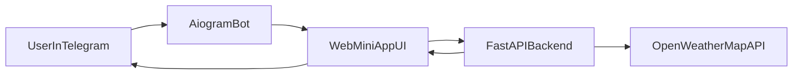

# План реализации Telegram Weather Mini App

## Цель

Собрать MVP Telegram-бота на Python, где основной ввод/вывод выполняется через Mini App, а данные берутся из OpenWeatherMap.

## Архитектура

## Что будет сделано

- Этап 1 (проверка Mini App интеграции): сделать mock-версию Mini App с одной кнопкой, которая при нажатии показывает сообщение: `Здесь скоро появится прогноз погоды, следите за новостями:)`; проверить, что Mini App корректно открывается из Telegram.
- Инициализировать Python-проект со структурой для `aiogram`-бота, `FastAPI`-backend и frontend Mini App.
- Реализовать Telegram-бота с кнопкой открытия Mini App (`web_app`) и базовой обработкой `/start`.
- Сделать Mini App интерфейс:
  - поле ввода города,
  - выбор периода прогноза (`1`, `3`, `10` дней),
  - кнопка получения прогноза,
  - отображение списка дней с `min/max` температурой и описанием погоды.
- Реализовать backend endpoint для прогноза (например, `GET /api/forecast?city=...&days=...`):
  - валидация входных параметров,
  - геокодинг города через OpenWeatherMap,
  - запрос прогноза и трансформация в единый ответ для UI,
  - обработка ошибок (город не найден, лимиты API, сетевые ошибки).
- Добавить конфигурацию через `.env` (токен бота, API-ключ OpenWeatherMap, URL Mini App).
- Добавить минимальные тесты backend логики (валидация и формат ответа) и инструкции запуска.

## Предлагаемая структура файлов

- `[project-root]/bot/main.py` — запуск бота и команда `/start`.
- `[project-root]/backend/app.py` — FastAPI приложение.
- `[project-root]/backend/services/openweather.py` — клиент OpenWeatherMap.
- `[project-root]/backend/schemas.py` — модели запросов/ответов.
- `[project-root]/miniapp/index.html` и `[project-root]/miniapp/app.js` — UI Mini App.
- `[project-root]/.env.example` — пример переменных окружения.
- `[project-root]/README.md` — запуск, настройки, сценарий использования.

## Критерии готовности MVP

- На первом шаге Mini App открывается из Telegram и кнопка в mock-интерфейсе успешно показывает заглушку: `Здесь скоро появится прогноз погоды, следите за новостями:)`.
- Mini App открывается из Telegram-кнопки.
- По валидному городу и периоду `1/3/10` отображаются дни с `min/max` и описанием погоды.
- При ошибках пользователь получает понятное сообщение в UI.
- Проект запускается локально по инструкции из README.

