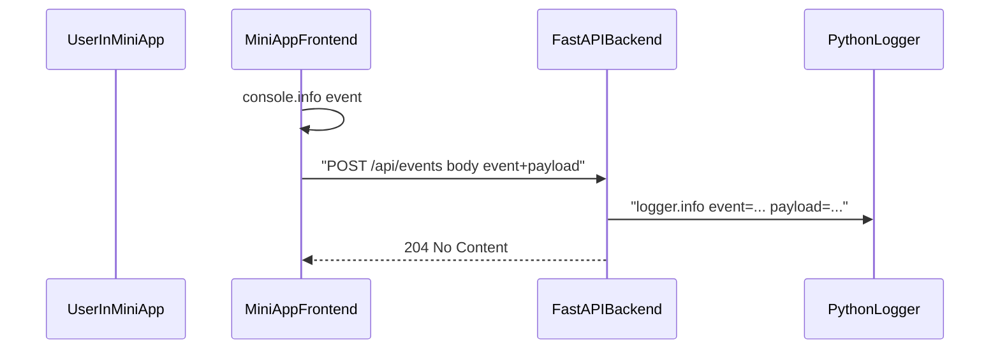

# Улучшения приложения: очистка, UI, команды бота, логирование фронтенда

## Обзор

Пять направлений, каждое отдельная тема для последующих коммитов. Источник данных остаётся Open‑Meteo. Затрагиваются `backend/app.py`, `bot/main.py`, `miniapp/*`, тесты и README.

## 1. Очистка legacy mock

- Удалить карточку `card-muted` и кнопку `mockButton` в [miniapp/index.html](miniapp/index.html).
- Удалить `mockButton` handler в [miniapp/app.js](miniapp/app.js).
- Удалить endpoint `GET /api/mock`, константу `MOCK_MESSAGE` в [backend/app.py](backend/app.py).
- Удалить `test_mock_endpoint` в [tests/test_api.py](tests/test_api.py).
- Подправить сообщение `/start` в [bot/main.py](bot/main.py): убрать «проверьте mock‑ответ».
- `/health` оставить как smoke‑test.
- Синхронизировать [README.md](README.md).

## 2. Улучшение UI Mini App

В файлах [miniapp/index.html](miniapp/index.html), [miniapp/app.js](miniapp/app.js), [miniapp/styles.css](miniapp/styles.css):

### Блочное представление

- Каркас из трёх секций‑блоков:
  - блок ввода: город + выбор длительности + кнопка;
  - блок сводки: крупно город, период, агрегированные `min` и `max` за период;
  - блок дней: сетка из одинаковых карточек‑дней.
- Каждый день — отдельная карточка с единой структурой: день недели, дата, эмодзи по `weather_code`, min/max °C, описание. Все карточки одного размера, выстроены в responsive grid (`grid-template-columns: repeat(auto-fit, minmax(140px, 1fr))`).

### Ползунок длительности

- Заменить `<select>` на кастомный сегментированный контрол по типу ползунка с тремя значениями `1 / 3 / 10`: три сегмента + подвижный «thumb», скользящий между ними по CSS‑transition при клике или свайпе.
- Под капотом — `<input type="range" min="0" max="2" step="1" list="daysTicks">`, отрисовываемый кастомными стилями; значение маппится `0 -> 1, 1 -> 3, 2 -> 10`. Для доступности дублируем скрытым `<select>` + `aria-label`.
- Состояния: активный сегмент подсвечен, анимация плавная, поддержка клавиатуры (стрелки).

### Красивый и ровный вывод температуры и прогноза

- Крупный заголовок‑сводка: `-3° / +5°` с моноширинной цифровой частью (`font-variant-numeric: tabular-nums`), чтобы цифры всегда одной ширины и колонки не «прыгали».
- В карточках дней температура всегда двухколоночная: `min` слева, `max` справа, с фиксированной сеткой, единицы «°» как отдельный `` постоянной ширины.
- Описание погоды обрезается `text-overflow: ellipsis` по двум строкам (`-webkit-line-clamp: 2`), чтобы карточки не скакали по высоте.
- Цветовой акцент: min — холодный оттенок, max — тёплый; все цвета через CSS‑переменные из темы Telegram, фоллбэк для браузера.

### Состояния интерфейса

- Skeleton‑карточки при загрузке (те же по размеру и сетке, но без текста).
- Явный блок ошибки с иконкой и текстом из `detail`.
- `disabled` у кнопки и ползунка во время запроса.

### Поведение формы

- Автофокус на поле города, `Enter` отправляет запрос.
- Trim и базовая валидация пустого поля.
- Сохранение последних `city` и `days` в `localStorage`, предзаполнение при открытии.

### Telegram и мелочи

- Поддержка темы Telegram через `Telegram.WebApp.themeParams` -> CSS‑переменные (`--bg`, `--text`, `--hint`, `--accent`).
- Локальный маппинг `weather_code -> emoji` во фронтенде; текстовое описание приходит с backend как сейчас.
- Favicon‑заглушка, чтобы убрать `404 /favicon.ico` из логов.

## 3. Доп команды в боте

В [bot/main.py](bot/main.py):

- `/help` — список команд с коротким описанием.
- `/about` — назначение бота и источник данных (Open‑Meteo).
- `/ping` — ответ `pong`, минимальный health‑check бота.
- `/forecast <город> [1|3|10]` — быстрый текстовый прогноз в чате без Mini App, через тот же клиент Open‑Meteo. Параметр дней опционален, по умолчанию `3`. Рендер построчно: `дата: min … max, погода`.
- Обработчик неизвестных команд и плейн‑текста: подсказка использовать `/help` или Mini App.
- `bot.set_my_commands(...)` при старте, чтобы команды появились в меню Telegram.
- Все хендлеры логируют `command`, `user_id`, `chat_id` через `logger.info`, ошибки Open‑Meteo через `logger.warning`, неожиданные — через `logger.exception`.

## 4. Логирование действий фронтенда (A + console)

Архитектура:

- Новый модуль `miniapp/logger.js` с обёрткой над `console` и fire‑and‑forget отправкой в `/api/events` через `navigator.sendBeacon` или `fetch keepalive`. При ошибке сети — тихо игнорируем, UI не ломается.
- Ключевые события: `miniapp_ready`, `submit_forecast`, `forecast_ok`, `forecast_error`, `command_hint_used`.
- Backend:
  - Новая pydantic‑схема `EventRequest` в [backend/schemas.py](backend/schemas.py): `event` из фиксированного `Literal`‑набора, `payload: dict[str, str | int]` с ограничением размера, опциональный `client_ts_ms`.
  - Endpoint `POST /api/events` в [backend/app.py](backend/app.py): возвращает `204`, пишет в `logging.getLogger("backend.events")`.
  - Простейший rate‑limit по IP через in‑memory счётчик (например, 60 событий/мин), чтобы публичный endpoint нельзя было заспамить.
  - Не логировать заголовки и cookies, никаких `init_data` и токенов.
- Тесты: `test_events_endpoint_accepts_known_event`, `test_events_endpoint_rejects_unknown_event`.

## 5. Мои дополнительные предложения

- Вынести `get_required_env` и настройку логирования в общий `backend/config.py` / `bot/config.py`, чтобы и бот, и backend имели одинаковый формат логов; `bot/main.py` перестаёт сам вызывать `basicConfig`.
- Добавить `uvicorn` access‑log отключить (сейчас дублирует middleware), либо выключить middleware — чтобы не было двойного логирования.
- Favicon и `robots.txt` (deny all) в `miniapp/`, чтобы WebView не ломился на 404.
- Обновить [.env.example](.env.example) описаниями (`LOG_LEVEL`, всё в комментариях).
- CI‑совместимый `pyproject.toml`/`pytest.ini` с `pythonpath = "."` — чтобы `pytest` стабильно находил `backend` и `bot`. Сейчас работает, но явная конфигурация надёжнее.

## План коммитов

- `chore(miniapp, backend)` — удалить legacy mock (пункт 1).
- `feat(miniapp)` — новый UI: карточки, тема, автокомплит формы (пункт 2).
- `feat(bot)` — команды `/help`, `/about`, `/ping`, `/forecast`, меню команд (пункт 3).
- `feat(api, miniapp)` — клиентское логирование и `POST /api/events` (пункт 4).
- `chore(config, infra)` — общий config, favicon, pytest.ini, docs (пункт 5).

Каждый коммит сопровождается обновлением тестов и README.