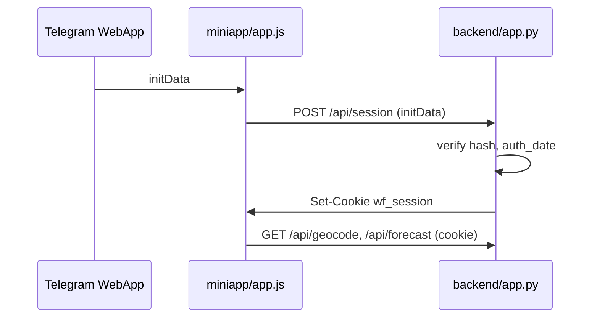

# Справочник: Weather Telegram Mini App

Читать после `SKILL.md`, когда нужны детали по файлам и потокам.

## Дерево (актуальное назначение)

```text
backend/
  app.py              # FastAPI: API + StaticFiles miniapp/
  schemas.py          # Pydantic: forecast, events, geocode
  telegram_webapp.py  # HMAC initData, auth_date, user
  services/open_meteo.py
bot/
  main.py             # aiogram, set_my_commands, MenuButtonWebApp
  forecast_args.py    # /forecast <city> [1|3|10] — без BOT_TOKEN при импорте
miniapp/
  index.html, app.js, logger.js, styles.css
tests/
  test_api.py, test_telegram_webapp.py, test_forecast_args.py
.cursor/
  rules/              # always-applied правила агента
  hooks/git_policy.py # conventional commit, pytest, README sync
  skills/             # workflow-скиллы проекта
  agents/             # git-change-push и др.
```

## Поток авторизации Mini App



## API backend

| Метод | Путь | Auth | Назначение |
|-------|------|------|------------|
| GET | `/health` | нет | `{"ok": true}` |
| POST | `/api/session` | initData в теле | cookie сессии |
| GET | `/api/public/config` | нет | `bot_url` для fallback UI |
| GET | `/api/geocode` | cookie | подсказки городов |
| GET | `/api/forecast` | cookie | `city`, `days` ∈ {1,3,10} |
| POST | `/api/events` | cookie | клиентские события, rate limit |
| GET | `/` | нет | статика miniapp |

## Переменные окружения (.env.example)

| Переменная | Назначение |
|------------|------------|
| `BOT_TOKEN` | Telegram Bot API |
| `SESSION_SECRET` | подпись session cookie |
| `BOT_URL` | ссылка на бота для экрана «только из Telegram» |
| `MINIAPP_URL` | публичный https URL backend/Mini App |
| `LOG_LEVEL` | опционально, backend |
| `COOKIE_SAMESITE`, `COOKIE_SECURE` | cookie в iframe Telegram |
| `INIT_DATA_MAX_AGE_SEC` | TTL initData |

## Команды бота

- `/start` — Menu Button WebApp при валидном `MINIAPP_URL`
- `/help`, `/about`, `/ping`
- `/forecast <город> [1|3|10]` — текстовый прогноз (тот же Open-Meteo клиент)

## Тесты (ожидание)

```bash
python -m pytest -q
# типично: 22 passed
```

Ключевые сценарии в `test_api.py`: session, 401 без cookie, geocode, forecast, events, rate limit.

## Cursor: правила и хуки

| Файл | Суть |
|------|------|
| `production-quality-default.mdc` | без костылей, обработка ошибок |
| `logging-project.mdc` | `logging`, не логировать секреты |
| `git-safety.mdc` | без force/reset без запроса |
| `general.mdc` | русский по умолчанию |
| `function-class-explanations.mdc` | описывать новые функции/классы |
| `git_policy.py` | conventional commits, pytest, README при изменении backend/bot/miniapp |

## Skills проекта

| Skill | Когда |
|-------|--------|
| `repo-onboarding` | этот анализ |
| `conda-python-env` | настройка Python env |
| `readme-actualization` | обновление README |
| `git-change-analysis-push` | commit/push на русском |

## Типичные зоны правок по задаче

| Задача | Файлы |
|--------|--------|
| Новый API endpoint | `backend/app.py`, `schemas.py`, `tests/test_api.py`, README |
| Auth / initData | `telegram_webapp.py`, `miniapp/app.js`, `test_telegram_webapp.py` |
| UI Mini App | `miniapp/*`, при необходимости `styles.css` |
| Команда бота | `bot/main.py`, `forecast_args.py`, тесты бота |
| Open-Meteo | `backend/services/open_meteo.py` |
